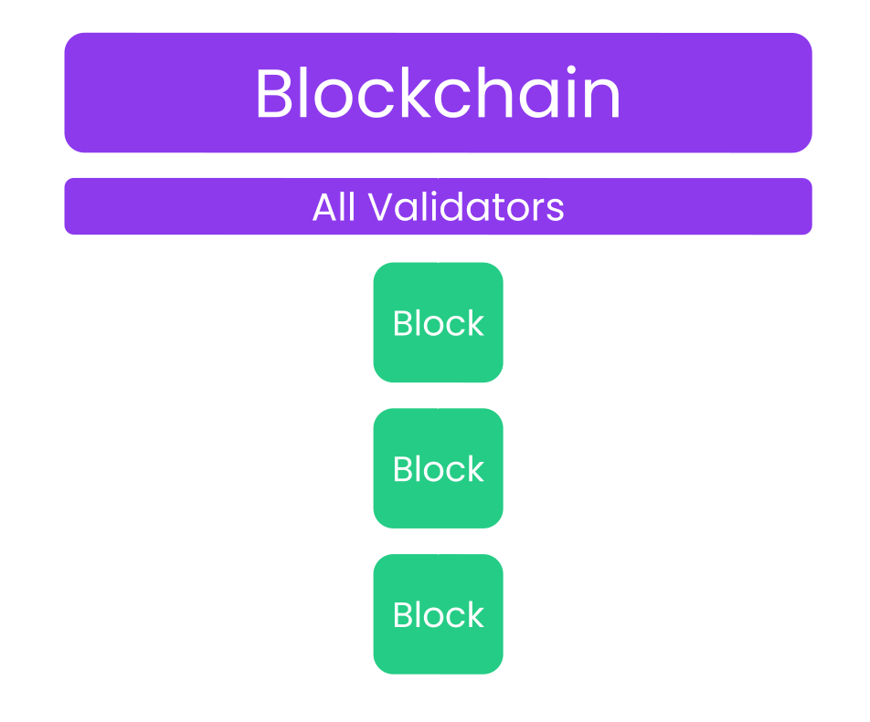
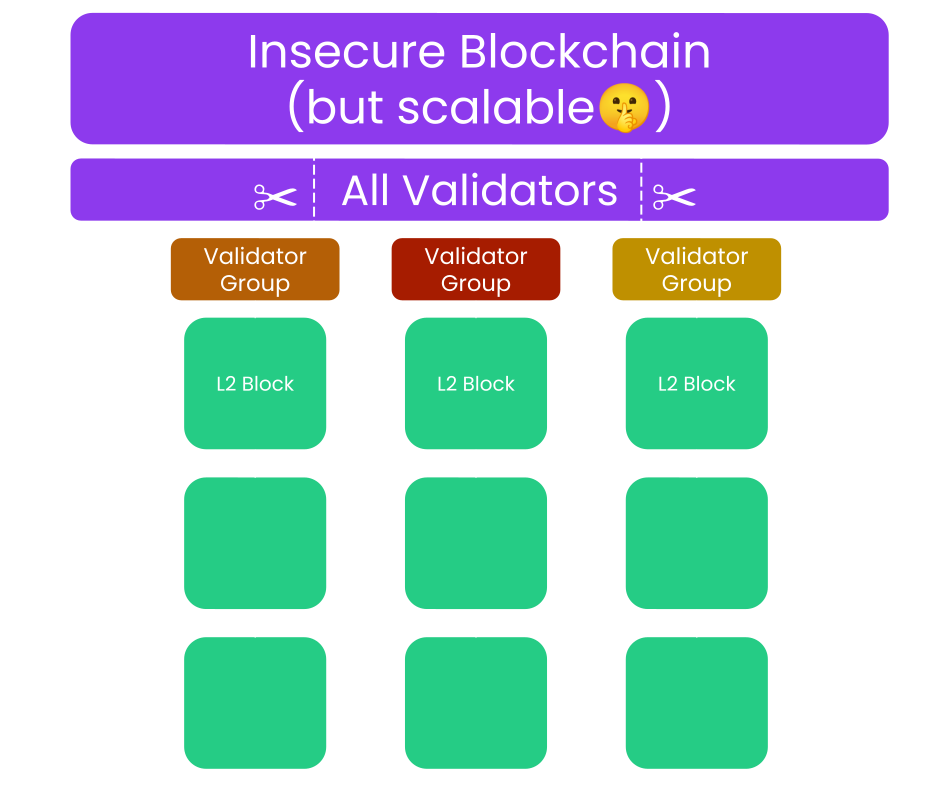
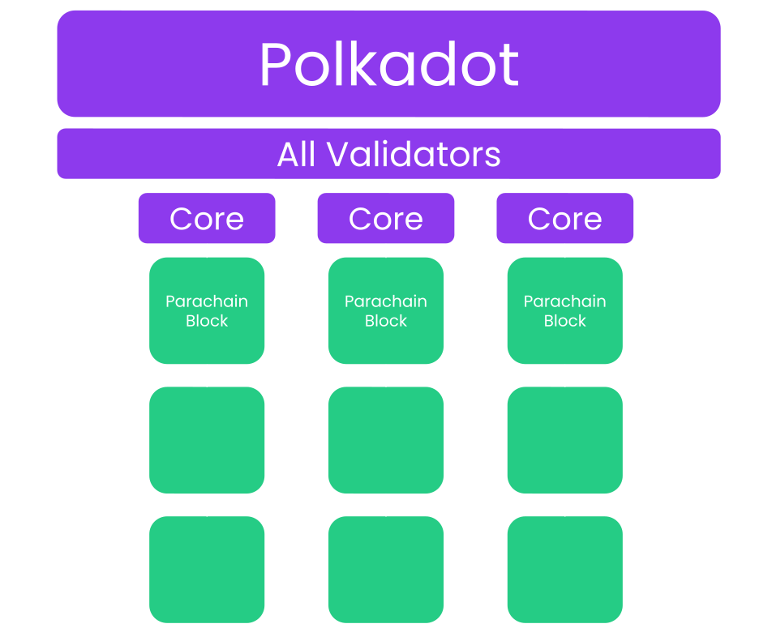
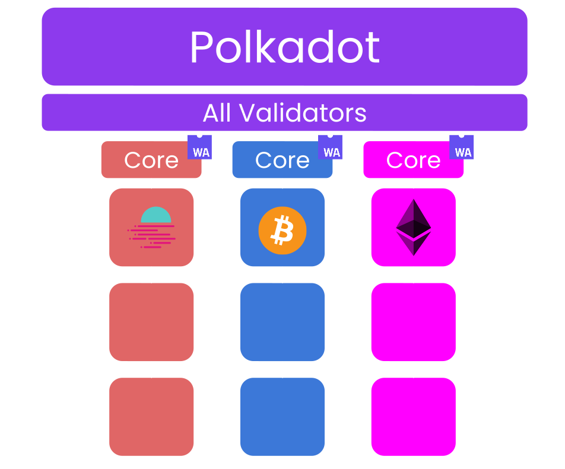
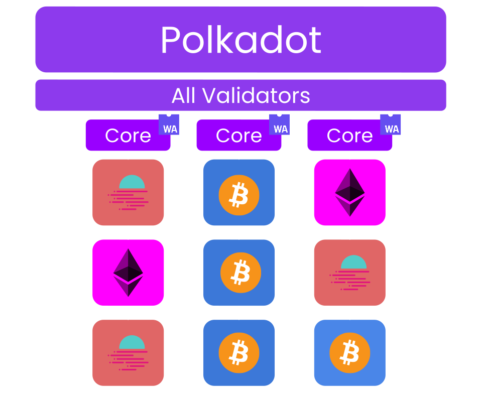
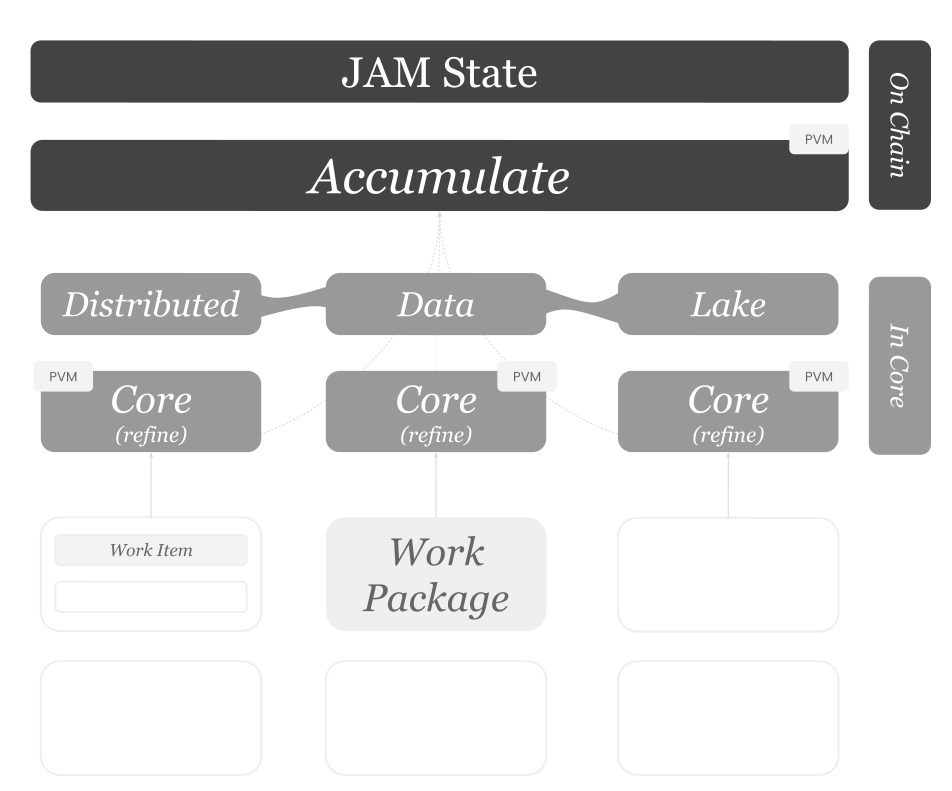
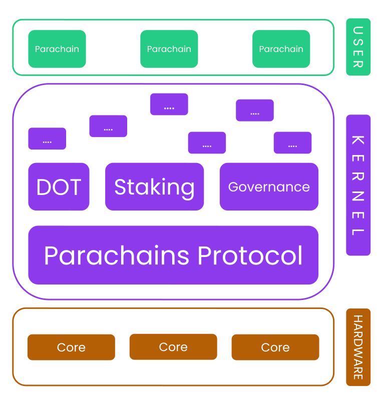
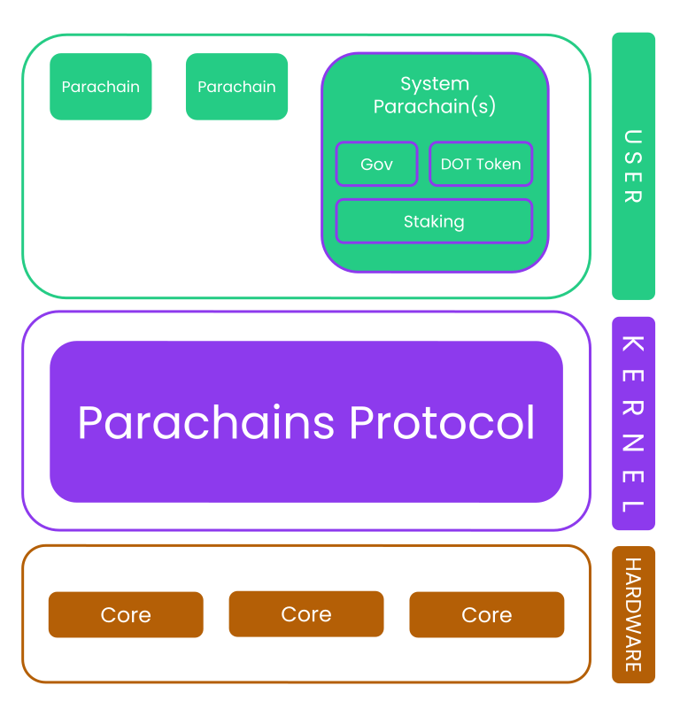
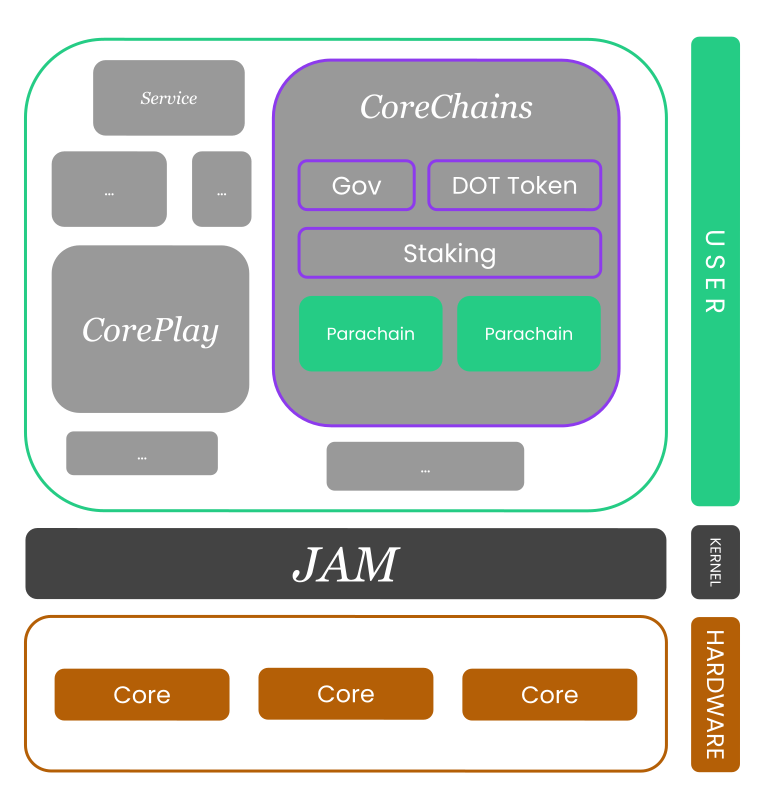

# 解密 JAM

> 原文：[Demystifying JAM](https://blog.kianenigma.nl/demystifying-jam)

以下是对 Polkadot 1，Polkadot 2 及其如何演变为 JAM [从零开始的逐步解释](https://www.navalmanack.com/almanack-of-naval-ravikant/how-to-think-clearly)。它面向技术人员，同时也更多地面向那些对 Polkadot 不太熟悉，但对基于区块链系统有一定深入理解，或是在这类生态系统技术上一定了解的人群。我相信在阅读 JAM [灰皮书](https://graypaper.com)之前本文会是一个很好的起点。

## 背景知识

本文使用并假定熟悉以下概念：

-   将区块链描述为状态转换函数。
-   理解什么是“状态”。
    -   这两者在[这里](https://paritytech.github.io/polkadot-sdk/master/polkadot_sdk_docs/reference_docs/blockchain_state_machines/index.html)有解释。
-   经济安全和股权证明。
    -   详解于此 [PBA 讲座](https://polkadot-blockchain-academy.github.io/pba-book/economics/economics-of-polkadot/page.html#staking-concept)，[录像](https://www.youtube.com/watch?v=suyram9vaFc)中。

## 前言：Polkadot 1

首先，回顾一下我认为 Polkadot 1 最具创新性的特点。

-   社会层面：
    -   Polkadot 无疑是一个庞大的去中心化自治组织（DAO）。该网络完全实现了链上自执行的治理，包括无需分叉的运行时升级。
    -   美国证券交易委员会（SEC）将 DOT 视为[软件，而非证券](https://polkadot.com/newsroom/press-releases/web3-foundation-announces-polkadot-blockchains-native-token-dot-has-morphed-and-is-software-not-a-security)。
    -   网络的大部分开发工作由波卡联盟（[Polkadot Fellowship](https://polkadot-fellows.github.io/dashboard)）完成，而非某个财务公司（如 [Parity](http://parity.io)）。
-   技术层面：
    -   共享安全性，分片执行。
    -   使用[基于 WASM 的元协议](https://paritytech.github.io/polkadot-sdk/master/polkadot_sdk_docs/reference_docs/wasm_meta_protocol/index.html)，将区块链代码以字节码形式存储在状态中。这不仅使大多数升级无需分叉，还使 Polkadot 不仅仅是分片的，更是异构分片的。关于[异构性](#异构性)，我们稍后会详细探讨。

现在，让我们深入探讨*分片执行*及其含义。

## 分片执行：核心解析

> 在这里，我们讨论的是一个托管其他 L2 “区块链”网络的 L1 网络，类似于 Polkadot 和 Ethereum。因此，L2 和平行链这两个词可以互换使用。

区块链扩展性的核心问题可以表述为：存在一组验证者，其代码执行的可信性通过权益证明的加密经济学得以保障。默认情况下，这些验证者被要求重新执行彼此的全部工作。因此，只要我们强制*所有验证者在任何时候都要重新执行一切*，整个系统就无法实现真正的扩展性。

需要注意的是，在这种模型下，即使增加验证者的数量，也并不会真正提升系统的吞吐量，只要上述绝对的重执行原则仍然有效。

以上展示了一个*单片式*（与*分片式*相对）区块链。所有网络验证者逐一处理输入（即*区块*）。

在这种系统中，如果 L1 想要承载更多的 L2，那么所有验证者都必须重新执行所有 L2 的工作。显然，这样的方式无法扩展。Optimistic Rollups 提供了一种解决方案，即仅在有人声称存在欺诈时，才进行重新执行（即欺诈证明）。而基于 SNARK 的 Rollups 通过利用验证 SNARK 证明的成本远低于生成成本的事实来规避这一问题，因此让所有验证者验证 SNARK 证明是合理的。详情可见[可扩展性空间图](#附录：可扩展性空间图)。

一种天真的分片解决方案是仅仅将验证者集合分割成更小的子集，并让这些较小的子集重新执行 L2 区块。这种方法的问题是什么呢？我们不仅在分片执行，还在分片网络的*经济安全性*。这样的 L2 的安全性低于 L1，随着我们将验证者集合切分成更多的分片，其安全性会不断下降。

与 Optimistic Rollups 相反，它们不能始终承担重新执行的成本，Polkadot 在设计时便考虑了执行分片，因此可以让其部分验证者重新执行 L2 区块，同时向所有网络参与者提供充分的加密经济证据，证明该 L2 区块的真实性与让整个验证者集重新执行一样安全。这得益于最近正式发布的 [ELVES](https://eprint.iacr.org/2024/961) 机制。

简而言之，ELVES 可以视为一种 Cynical Rollup 机制。通过几轮验证者主动询问其他验证者 L2 区块是否有效，我们可以达到极高的概率确认该区块的有效性。确实，在任何争议情况下，很快就会要求整个验证者集参与进来。对此，Polkadot 联合创始人 Rob Habermeier 在其[文章](https://polkadot.network/blog/polkadot-v1-0-sharding-and-economic-security#approval-checking-and-finality)中进行了详细解释。

ELVES 机制使得 Polkadot 能够同时具备两个此前被认为互不相容的特性：“_分片执行_”与“_共享安全_”。这是 Polkadot 1 在扩展性方面的主要技术成果。

现在，让我们继续讨论“核心”的比喻。

一个执行分片链非常像一个中央处理器：就像中央处理器可以有多个*核心*并行执行指令一样，Polkadot 能够并行推进 L2 区块。这也是为什么在 Polkadot 中，一个 L2 被称为 **_平行链_**[^1]，而由较小的验证者子集重新执行单个 L2 区块的环境被称为“核心”。每个核心可以抽象为“一个协调合作的验证者群体”。
[^1]: 平行链。

你可以将单块链想象成在任何给定的时间槽内只处理一个区块，而 Polkadot 则在每个时间槽内处理 1 个中继链区块和每个核心上的 1 个平行链区块。

### 异构性

到目前为止，我们只讨论了可扩展性，并且提到 Polkadot 提供了分片执行。需要注意的是，Polkadot 的每个分片都是完全不同的应用程序[^2]。这通过使用一种字节码存储的元协议来实现：一种将区块链定义存储为字节码在区块链状态中的协议。在 Polkadot 1 中，WASM 被用作首选字节码，而在 JAM 中，[PVM](#PVM)/RISC-V被采用。
[^2]: 亦即区块链或状态转换函数。

总的来说，这就是为什么 Polkadot 被称为 [_异构分片区块链_](https://x.com/kianenigma/status/1790763921600606259)。每个 L2 都是一个完全不同的应用程序。

## Polkadot 2

Polkadot 2 的一个重要部分是使核心的使用更加灵活。在最初的 Polkadot 模型中，核心的租赁期限通常为 6 个月到 2 年不等。这种模式适合资金雄厚的企业，但对小型团队来说却不那么友好。而实现 Polkadot 核心更灵活使用的功能被称为[_“灵活核心时间”_](https://polkadot.network/features/blockspace/agile-coretime)。在这种模式下，Polkadot 核心的租赁时间可以短至一个区块，最长可达一个月，并为长期租赁者提供价格上限保障。

Polkadot 2 正在逐步展开，相关特性已不需赘述。

## 核心内运行 vs. 链上运行

为了理解 JAM，首先需要了解当 L2 区块进入 Polkadot 核心时会发生什么。

> 以下内容进行了大量简化。

请记住，核心主要由一组验证者组成。因此，当我们说“数据被发送到核心”时，它实际上是通过传播协议传递给这组验证者的。

0. 一个 L2 区块及其部分状态被发送到核心。这些数据是执行 L2 区块所需的一切[^3]。
1. 由核心组成的一部分验证者重新执行 L2 区块，并继续进行进一步的共识相关任务。
2. 核心验证者将重新执行所需的数据 **_提供_** 给其他验证者（即核心之外的验证者）。进一步的验证者可能根据 ELVES 规则选择重新执行此 L2 区块，并且他们需要这些数据来进行操作。

[^3]: 在 Polkadot 1 中，我们称 L2 的状态证明为 PoV（有效性证明），而状态证明与平行链区块的结合体则称为 PVF（平行链验证函数）。

> 请注意，到目前为止，所有操作都发生在 Polkadot 主链和状态转换函数之外。这一切都发生在核心内部以及数据可用性层上。

3. 最终，L2 的最新状态的小部分承诺会在 Polkadot 主中继链状态中可见。这一操作成本远低于实际重新执行 L2 区块的成本，且不同于之前的一切，它会影响到 Polkadot 主状态，并且在 Polkadot 区块中可见，由所有 Polkadot 验证者执行。

从上述过程，我们可以探讨 Polkadot 所执行的一些操作：

从步骤 1 中，我们可以得知在 Polkadot 中存在一种不同于传统区块链状态转换函数的新型执行模式。通常情况下，当网络的所有验证者执行某项工作时，主区块链状态会被更新。我们称这种操作为**链上操作**。这就是步骤 3 中发生的事情。然而，核心内部发生的情况（步骤 1）与此不同。我们称这种新型区块链计算为**核心内执行**。

接下来，从步骤 2 我们可以推断出，Polkadot 已经原生提供了一个数据可用性层（以下简称 _DA_），L2 会自动利用它来在一定时间内保持执行证据的可用性。然而，可以发布到此 DA[^4] 层的 blob 数据是固定的，且始终是重新执行 L2 区块所需的证据。此外，平行链代码从不读取 DA 层的数据。

[^4]: 请注意，灰皮书将此 DA 层称为分布式数据湖（Distributed Data Lake），简称 DDL。为了减少本文中新增术语的数量，我们继续称其为 DA 或 DA 层。

理解上述内容是理解 JAM 大部分功能的基础。总结如下：

-   **核心内执行**：发生在核心内部的操作。充裕、可扩展，并通过密码经济学和 ELVES 机制提供与链上执行同等的安全性。
-   **链上执行**：发生在所有验证者中的操作。默认通过经济安全的验证者保障安全性。成本更高，限制更多，因为每个人都在执行一切操作。
-   **数据可用性**：Polkadot 验证者在一定时间内承诺数据可用，并将其提供给其他验证者的能力。

## JAM

在前一部分的理解基础上，我们可以顺利过渡到对 JAM 的探讨。

_JAM 是一种全新的协议，深受 Polkadot 的启发，并与之完全兼容，旨在替代 Polkadot 的中继链，并使核心的使用变得彻底去中心化[^5]。_

[^5]: 需要特别指出的是，JAM 仅旨在替代 Polkadot **中继链**。平行链及所有运行在 Polkadot 之上的应用程序将保持不变，这主要得益于 [CoreChains 服务](#CoreChains-服务)。

JAM 建立在 [Polkadot 2](#Polkadot-2) 的基础上，它试图使 Polkadot 的核心更易于访问，但方式比敏捷核心时间更加灵活和去中心化。

-   Polkadot 2 使 L2 的部署在核心上更加灵活。
-   JAM 则致力于在 Polkadot 核心上部署*任何应用*，即便是那些与区块链或 L2 毫不相似的应用。

**这主要通过将前一部分讨论的三个主要原语暴露给开发者来实现，即：链上、核心内以及 DA 层。**

换句话说，在 JAM 中，开发者可以：

1. 使核心内和链上正在进行的工作完全可编程。
2. 允许任意数据从 Polkadot 的 DA 层中读取和写入。

这是一份对 JAM 目标的基础性描述。毋庸置疑，这里简化了很多内容，协议本身可能仍会演变。

有了这个基础，我们可以在接下来的部分深入探讨 JAM 的若干细节。

### 服务与工作项

因此，在 JAM 的语境下，过去被称为 L2 或平行链的概念现在被称为“服务”，而过去被称为区块/交易的概念则被称为“工作项”或“工作包”。具体来说，工作项属于某个服务，而工作包则是工作项的集合。这两个术语被有意选择为足够通用，以涵盖区块链或 L2 之外的各种用例。

一个服务由三个入口点来描述，其中两个是 `fn refine()` 和 `fn accumulate()`[^6]。前者描述了服务在核心中执行的操作，后者则描述了服务在链上执行的操作。

[^6]: 第三个入口点是 `on_message`，在接收到来自其他服务的消息时被调用。

最后，这两个入口点的名称也是该协议被称为 JAM 的原因：即 “Join Accumulate Machine”（联合累积机器）。**Join** 对应 `fn refine()`，当所有 Polkadot 内核为不同的服务并行处理大量工作时，数据被提炼成更小的子集，然后传递到下一个阶段。**Accumulate** 则是在前述所有结果被“累积”到主 JAM 状态中时进行，这是链上执行的部分。

> 工作项（Work-items）可以精确地指定它们在内核执行、链上运行的代码，以及它们如果/如何/哪些对分布式数据湖中的数据进行读写。

### 半一致性

回顾关于 XCM 的现有材料——Polkadot 为平行链通信选择的语言，[所有此类通信都是异步的](https://github.com/polkadot-fellows/xcm-format?tab=readme-ov-file#11-xcm-communication-model)。也就是说，消息一旦发送，无法等待其回复。

**异步性**是**非一致**系统的体现，也是永久分片系统（如 Polkadot 1 和 Polkadot 2 以及现有的 Ethereum L2 解决方案）的一大缺陷。

然而，如[灰皮书](https://graypaper.com/graypaper.pdf)第 2.4 节所述，一个始终对所有租户**同步**的完全**一致**系统在不牺牲通用性、可访问性或弹性的情况下，其增长也仅限于一定范围。

> 同步 ~ 一致 || 异步 ~ 非一致

JAM 在此方面脱颖而出：通过引入多个特性，JAM 实现了一种新的中间状态，即**半一致系统**。在这种系统中，频繁通信的子系统之间有机会创建彼此一致的环境，而无需强制整个系统保持一致。在这次采访中，灰皮书的作者 Dr. Gavin Wood 在此[视频](https://www.youtube.com/watch?v=O3kRAVBTkfs&t=1378s)中非常好地描述了这一点。

另一种理解方式是将 Polkadot/JAM 视为一种分片系统，其中这些分片的边界是灵活的，并且可以动态确定。

> Polkadot 从一开始就是分片的，并且是完全异质的。
>
> 现在，它将继续保持分片和异质性，同时这些分片的边界可以灵活确定，这正是 [@gavofyork](https://x.com/gavofyork?ref_src=twsrc%5Etfw) 在 [https://t.co/tjAboJL9IA](https://t.co/tjAboJL9IA) 中提到的半一致系统。
>
> \- Kian Paimani (@kianenigma) [May 15, 2024](https://x.com/kianenigma/status/1790763921600606259?ref_src=twsrc%5Etfw)

使这一切成为可能的特性包括：

1. 访问无状态的并行内核执行环境，在同一块中，不同服务只能与驻留在同一内核上的其他服务同步交互，而链上执行则允许服务访问所有内核中所有服务的结果。
2. JAM 不强制执行任何特定的服务调度。频繁通信的服务可以通过经济激励促使其排序器创建包含频繁通信服务的 `WorkPackages`，使它们驻留在同一内核中，从实践上实现如同在同步环境下的通信。
3. 此外，JAM 服务可以访问 DA 层，并将其用作临时但极其廉价的数据层。一旦数据被放置在 DA 中，它最终会传播到所有内核，但保证在同一内核中立即可用。因此，JAM 服务通过将自己调度到连续区块中的同一内核，可以享受更高程度的数据访问[^7]。

[^7]: 有关服务调度的更多信息，请参阅灰皮书中的“授权”部分。

需要注意的是，尽管上述情况在 JAM 中是*可能的*，但协议层不强制执行。因此，某些接口*理论上是异步的*，但通过巧妙的抽象和激励机制，可以*在实践中表现为同步*。在下一节讨论的 CorePlay 就是一个例子。

### CorePlay

本节介绍了 `CorePlay`，这是在 JAM 背景下的一个实验性构想，可以被描述为一种智能合约编程的新模型。截止本文撰写时，CorePlay 仍未明确定义[^8]，仅停留在概念阶段。

为了理解CorePlay，我们首先需要介绍JAM所选择的虚拟机，PVM。

[^8]: 关于 CorePlay 最好的书面资源是[这个](https://github.com/polkadot-fellows/RFCs/tree/gav-coreplay) RFC 草案。

#### PVM

JAM 和 CorePlay 的重要组成部分是 [Polkadot 虚拟机，简称 PVM](https://forum.polkadot.network/t/announcing-polkavm-a-new-risc-v-based-vm-for-smart-contracts-and-possibly-more/3811)。PVM 的底层细节超出了本文的讨论范围，最好由灰皮书进行专业领域的描述。然而，为了本文的目的，我们只需阐明 PVM 的几个关键属性：

-   高效的计量
-   支持暂停与恢复执行

后者对 CorePlay 尤为重要。

CorePlay 是利用 JAM 灵活原语创建同步且可扩展的智能合约环境的一个示例，其编程接口极为灵活。CorePlay 建议直接在 JAM 核心上部署基于 Actor 模型的智能合约，使其能够享受同步编程接口，合约可以被编写成一个普通的 `fn main()`，在其中可以通过 `let _result = other_coreplay_actor(data).await?` 进行通信。如果 `other_coreplay_actor` 在同一个 JAM 区块内的同一核心中，这一调用是同步的；如果位于另一个核心，Actor 将被暂停，并将在后续的 JAM 区块中恢复。这一切得以实现，正是因为 JAM 服务及其灵活的调度机制，以及 PVM 的特性。

### CoreChains 服务

最后，我们提醒各位读者，JAM 与 Polkadot **完全兼容**的主要原因。Polkadot 的核心产品是以敏捷核心时间模式运作的平行链，这一产品在 JAM 中得以延续。

JAM 上可能部署的首个服务很可能被称为 `CoreChains` 或 `Parachains`。该服务将允许现有的 Polkadot 2 形式的平行链在 JAM 上执行。

进一步的服务可以在 JAM 上部署，现有的 `CoreChains` 服务可以与它们进行通信，但 Polkadot 的现有产品将依然强大，且新的机遇将为现有的平行链团队开启。

## 附录：数据分片

本文大部分内容探讨了从执行分片角度来看区块链的可扩展性。我们也可以从数据的角度来审视这一问题。有趣的是，我们发现了一种与[半一致性](#半一致性)中提到的情况类似的情形：理论上，完全一致的系统更为理想，但无法扩展；完全不一致的系统虽具备极高的扩展性，但并不理想，而 JAM 凭借其半一致性模式，为我们提供了一种新的可能性。

**完全一致的系统**：这就是我们在完全同步的智能合约平台上看到的情况，如 Solana，或那些勇敢地仅部署在 Ethereum L1 上的项目。所有应用数据都存储在链上，其他应用可以轻松访问。这种特性非常适合编程能力的发挥，但无法实现良好的扩展性。

**不一致的系统**：应用数据保存在 L1 之外，并分布在不同的、隔离的分片中。虽然极具扩展性，但对可组合性不利。这正是 Polkadot 和 Ethereum Rollup 模型的做法。

JAM 不仅能提供上述两者的优势，还允许程序员将任意数据发布到 JAM 的 DA 层中，这在某种程度上是链上数据和链下数据之间的折中。利用 DA 层存储大部分应用数据，仅将绝对关键的数据持久化到 JAM 状态中，由此可以开发出一种全新的应用类别。

## 附录：可扩展性空间图

这一部分重新阐述了我们对区块链可扩展性格局的看法。这在我们的灰皮书中也有详细解释，而此处则是一个更为简洁的版本。

区块链的可扩展性在很大程度上借鉴了传统分布式系统的思路：垂直扩展和水平扩展。

垂直扩展是 Solana 等项目的做法，通过对代码和硬件的极致优化，来实现最大化的吞吐量。

水平扩展则是 Ethereum 和 Polkadot 采用的方法：减少每个节点必须执行的工作量。在传统分布式系统中，这通常通过增加更多的复制机器来实现。在区块链中，“计算机器”相当于整个网络的验证者集合。通过在验证者之间分配工作（如 ELVES 所做的那样），或乐观地减少他们的职责（如 Optimistic Rollups 所做的那样），我们可以减少整个验证者集合的工作负载，从而实现系统的水平扩展。

> 区块链中的水平扩展类似于“减少必须执行所有工作的机器数量”。

总结如下：

1. 垂直扩展：在单一链上通过强大的硬件和优化实现扩展。
2. 水平扩展：
    1. Optimistic Rollups
    2. 基于 SNARK 的 Rollup
    3. ELVES：Polkadot 的 Cynical Rollup

## 附录：相同硬件，内核更新

本节基于 Rob Habermeier 在 Sub0 2023 中的一个类比：[Polkadot: Kernel/Userland | Sub0 2023 - YouTube](https://www.youtube.com/watch?v=15aXYvVMxlw)，阐释了 JAM 作为 Polkadot 的一种**升级**，即在相同硬件基础上的内核更新。

在典型的计算机系统中，我们可以将整个架构划分为三个部分：

1. 硬件
2. 内核
3. 用户空间

在 Polkadot 中，所谓的**硬件**，即提供计算能力和数据可用性的核心部分，一直以来都是上述所描述的核心。

Polkadot 中的**内核**，实际上[^9]，迄今为止主要由两部分组成：

1. 平行链协议——一种对核心使用的有明确意见和固定方式。
2. 一组底层功能，如 DOT 代币及其可转移性、质押、治理等。

这两者目前都存在于 Polkadot 的中继链中。

[^9]: 强调“实际上”一词，因为即便在前述演讲中，Rob 也将平行链协议视为 Polkadot 的用户空间应用。但这仅是一种理论假设，平行链协议已深度融 入Polkadot 核心协议，即内核本身。

**用户空间**应用最终是平行链的实例、它们的原生代币，以及在其之上构建的任何其他内容。

我们可以将其可视化如下：

Polkadot 始终致力于将更多核心功能转移至其一流用户——平行链。这正是 [Minimal Relay RFC](https://github.com/polkadot-fellows/RFCs/blob/main/text/0032-minimal-relay.md) 所要实现的目标。

这意味着 Polkadot 中继链仅负责提供平行链协议，从而在一定程度上缩小了内核空间。

一旦这种架构完成，JAM 迁移的未来图景将更加清晰。JAM 将大幅缩减 Polkadot 的内核空间，并使其更具通用性。此外，平行链协议被移至用户空间，因为这是在相同硬件和内核（JAM）上编写应用程序的唯一途径之一。

> [!info] 这也最后一次说明，JAM 只是 *Polkadot 中继链*的替代方案，而不是平行链的替代方案。

换句话说，我们可以将 JAM 迁移视为一次内核升级。底层硬件保持不变，而旧内核的大部分被转移到用户空间以简化系统。

## 资源

-   [7.9 Polkadot 2.0：核心游戏、核心链、核心共识、Safrole、PolkaVM - Gavin @PBA4 的 Polkadot - YouTube](https://www.youtube.com/watch?v=n0ZCKjfIVhc)
-   [Gavin Wood: 灰皮书访谈 - JAM 与 Polkadot 的未来 - 《幕后代码：Web3 思想者》 - YouTube](https://youtu.be/O3kRAVBTkfs?si=Uc6SxxkNn1g8lHkA)
